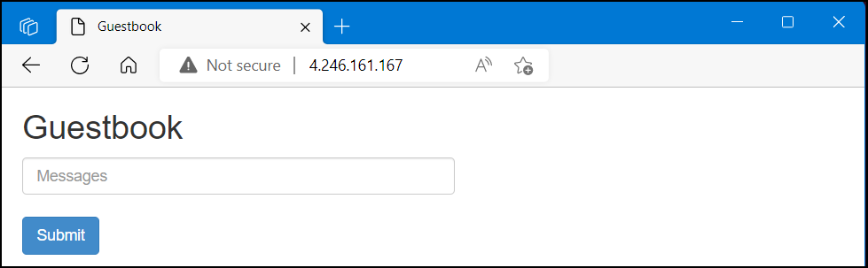

# Ingress Demo Script
Install ingress controller. 
>NOTE: Change to the demos/ingress directory

## Install Ingress Controller (NGINX Community edition)
``` bash
helm repo add ingress-nginx https://kubernetes.github.io/ingress-nginx
helm repo update
helm install ingress-nginx ingress-nginx/ingress-nginx \
  --create-namespace \
  --namespace ingress-basic \
  --set controller.service.annotations."service\.beta\.kubernetes\.io/azure-load-balancer-health-probe-request-path"=/healthz
  ```

## Deploy Guestbook Application to AKS 
  ```bash 
    kubectl create -f guestbook-all-in-one.yaml
  ```

## View Ingress YAML
review **path:** and **service.name:** 
```yaml

apiVersion: networking.k8s.io/v1
kind: Ingress
metadata:
name: guestbook-ingress
spec:
ingressClassName: nginx
rules:
- http:
    paths:
    - path: /
        pathType: Prefix
        backend:
        service:
            name: guestbook-svc
            port: 
            number: 80
```
### Deploy Ingress

```bash
kubectl create -f ingress.yaml
```
Wait for **ADDRESS** to appear
```bash 
kubectl get ingress
```


Open your local browser and navigate to the IP Address displayed under **ADDRESS**

>NOTE: Your IP Address will be different




## Cleanup 
```bash
kubectl delete -f guestbook-all-in-one.yaml -f ingress.yaml 
```

