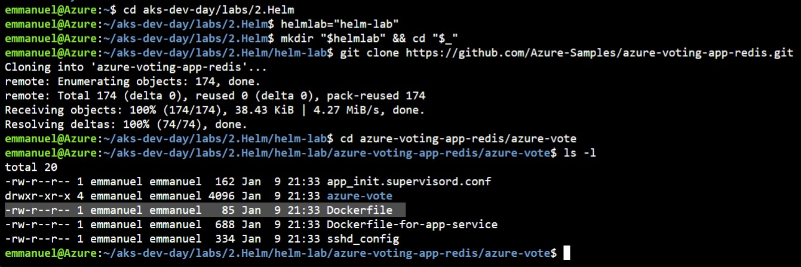
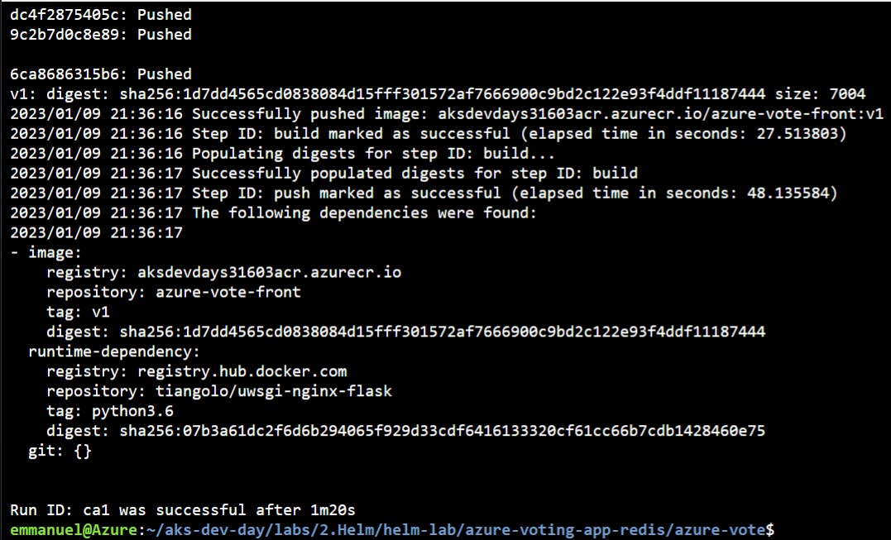
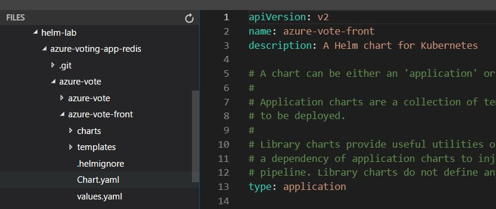
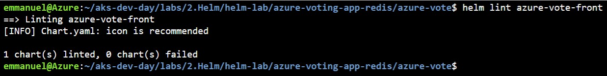
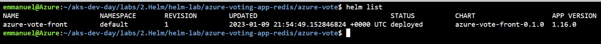
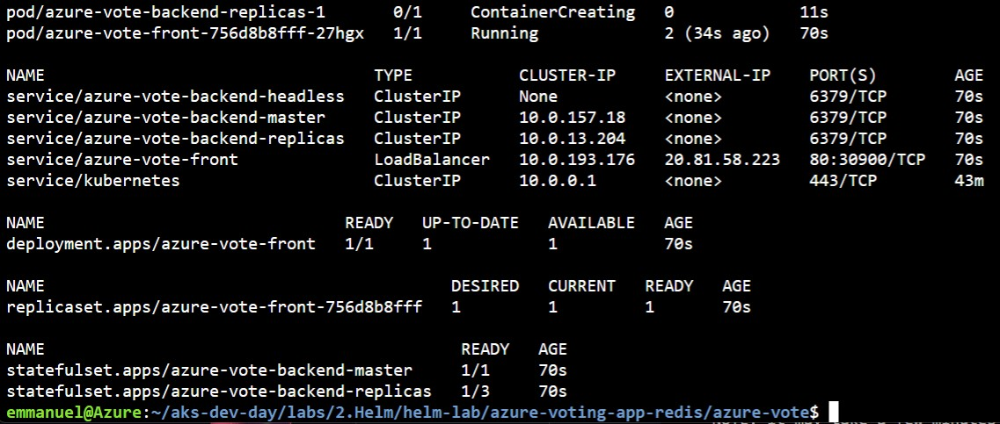
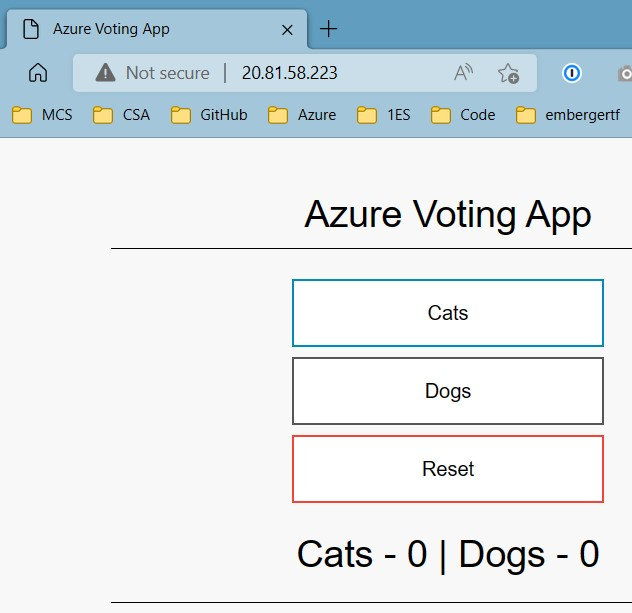
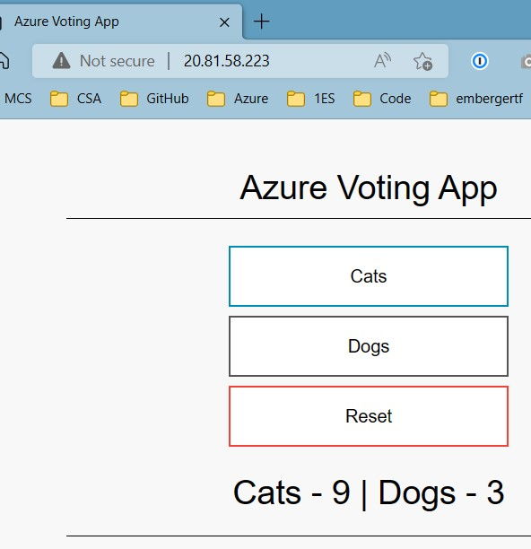

# Helm Lab

## Overview

In this Lab, you will use Helm to package and deploy an application on the AKS cluster.
[Helm](https://helm.sh/) is the package manager for Kubernetes.
Helm Charts help you define, install, and upgrade even the most complex Kubernetes application.
Charts are easy to create, version, share, and publish.

## Prerequisites

To perform this Lab, you'll need:

- An AKS cluster (created in `setup.md`)
- An Azure Container Registry (created in `setup.md`)
- Azure CLI installed (Check with `az version`)
- [Helm v3 installed](https://helm.sh/docs/intro/install/) (Check with `helm version`)
- git client (Check with `git version`)

## Steps

### Move in the Helm lab folder

```bash
cd aks-dev-day/labs/2.Helm
```

### Prepare the application

We will clone the application locally and use the ACR to create and store its image:

```bash
helmlab="helm-lab"
mkdir "$helmlab" && cd "$_"
git clone https://github.com/Azure-Samples/azure-voting-app-redis.git
cd azure-voting-app-redis/azure-vote
ls -l
```

Verify you see a file named `Dockerfile`:



We use the file to build the application image:

```bash
az acr build --image azure-vote-front:v1 --registry $acr_server --file Dockerfile .
```



That shows you the ACR can be used directly to build images. It's a simpler process than building them locally, tagging them, and pushing them to an ACR.
Additionally, an ACR can import and manage Helm charts. For more information, see [Push and pull Helm charts to an Azure container registry](https://learn.microsoft.com/en-us/azure/container-registry/container-registry-helm-repos).

### Create the application Helm chart

Generate the Helm chart for the app with:

```bash
helm create azure-vote-front
```

This command creates an `azure-vote-front` folder with the Helm chart in it.

Open the editor:


Go in the folder `azure-vote-front` and look at the content structure ([The Chart File Structure](https://helm.sh/docs/topics/charts/#the-chart-file-structure)).



A Helm chart is organized as a collection of files inside of directories:

File | Comment | Reference
---------|----------|----------
 `Chart.yaml` | This file is the application manifest. It sets the version, dependencies, information on the app, etc. | [The Chart.yaml File](https://helm.sh/docs/topics/charts/#the-chartyaml-file)
 `.helmignore` | The .helmignore file is used to specify files you don't want to include in your helm chart. | [The .helmignore file](https://helm.sh/docs/chart_template_guide/helm_ignore_file/#helm)
 `values.yaml` | This file sets the default values of the Helm chart | [Values](https://helm.sh/docs/chart_best_practices/values/#helm)
 `charts/` | This folder contains any charts upon which this chart depends. It allows manual management of dependencies. The other way is to declare them in the `Chart.yaml` | [Chart dependencies](https://helm.sh/docs/topics/charts/#chart-dependencies)
 `templates/` | A directory of templates - mainly `YAML` files - that, when combined with values, generate valid Kubernetes manifest files. | [Templates](https://helm.sh/docs/chart_best_practices/templates/#helm)

To understand, at a high-level, how Helm charts work, open the `templates/service.yaml` file.
You will see the mix of Kubernetes YAML declarations, and sections surrounded by `{{ ... }}`. These sections are anchors for Helm to generate the content based on values and operations.

### Adapt the Helm chart

1. Update the `Chart.yaml` to add a dependency on the `redis` chart, by adding this declaration:

    ```yaml
    dependencies:
      - name: redis
        version: 17.3.14
        repository: https://charts.bitnami.com/bitnami
    ```

    From:

    

    To:

    

    Save the file and run:

    `helm dependency update azure-vote-front`

    Success looks like:

    

    Additionally, you will see a `redis-17.3.14.tgz` file added to the `charts/` folder:

    

2. Update the `values.yaml` to set the defaults for the chart:

    - Replace the default section:

      FROM:

      ```yaml
      replicaCount: 1

      image:
        repository: nginx
        pullPolicy: IfNotPresent
        # Overrides the image tag whose default is the chart appVersion.
        tag: ""
      ```

      TO:

      ```yaml
      replicaCount: 1

      backendName: azure-vote-backend-master
      redis:
        image:
          registry: mcr.microsoft.com
          repository: oss/bitnami/redis
          tag: 6.0.8
        fullnameOverride: azure-vote-backend
        auth:
          enabled: false

      image:
        repository: aksdevdays31603acr.azurecr.io/azure-vote-front
        pullPolicy: IfNotPresent
        # Overrides the image tag whose default is the chart appVersion.
        tag: "v1"
      ```

      **Important Notes**:
      - See that the repository for the image (`image.repository`) uses our ACR server name: replace appropriately.
      - If copying the `YAML`, careful with the spacing and indentation!

    - Change `service.type` to LoadBalancer:

      FROM:

      ```yaml
      service:
        type: ClusterIP
        port: 80
      ```

      TO:

      ```yaml
      service:
        type: LoadBalancer
        port: 80
      ```

3. Update the `templates/deployment.yaml` to set the redis environment variable value:

    FROM:

    ```yaml
    ...
    imagePullPolicy: {{ .Values.image.pullPolicy }}
    ports:
    ...
    ```

    TO:

    ```yaml
    ...
    imagePullPolicy: {{ .Values.image.pullPolicy }}
    env:
    - name: REDIS
      value: {{ .Values.backendName }}
    ports:
    ...
    ```

### Test the Helm chart

To test all the changes did not break the Chart, run:

`helm lint azure-vote-front`

If any errors (and with YAML it's easy to have some with indentation), they will show.

Success looks like:



### Install the Application in AKS

To deploy to an AKS cluster, Helm will leverage the credentials used by `kubectl` (since v3+).

Check your access to the cluster with admin permissions:

`kubectl get nodes`

> if the command fails, fix with AKS tools (Usually: `az aks install-cli` & `az aks get-credentials -g $rg -n $aks_name`)

Install the Helm chart release:

`helm install azure-vote-front azure-vote-front/`

Success looks like:


See the Release in the AKS Cluster:

`helm list`



See the deployment of the Application in AKS:

`kubectl get all`



Check the application is operational:

- run

  `kubectl get svc`
  
  to obtain the `EXTERNAL-IP` of the service `azure-vote-front`

    

- Browse to the IP with `http://<EXTERNAL-IP>`, until the `"Azure Voting App"` appears

    

- if `Cats` and `Dogs` add, then the redis cache is used and the application successfully deployed with all its components

    

### Uninstall the Application in AKS

- Uninstall the Helm chart release:

  `helm uninstall azure-vote-front`

    

- See all the deployed resources are cleared with:

  `kubectl get all`

    
