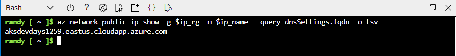
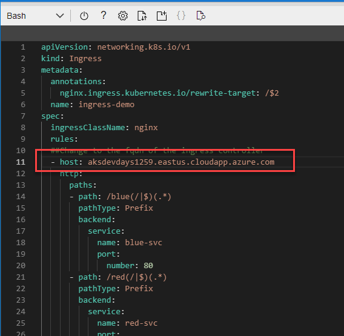

# Lab: Ingress 

In this lab you will:
1. Create a static IP Address and assign a DNS label to it
1. Install an Ingress Controller and assign the static IP address
1. Deploy a multi-tier application and Ingress rules to route Internet traffic to one of the the application services. 

>  NOTE</br>
There are two open source ingress controllers for Kubernetes based on Nginx: one is maintained by the Kubernetes community [kubernetes/ingress-nginx](https://github.com/kubernetes/ingress-nginx), and one is maintained by NGINX, Inc. [nginxinc/kubernetes-ingress](https://github.com/nginxinc/kubernetes-ingress). This Lab will be using the Kubernetes community ingress controller.

>Duration 30 minutes

### Setup 
If not already done, create an AKS Cluster according to the instructions found [here](../setup.md)

## Install NGINX Ingress controller 

### Create a Public IP Address with Fully Qualified Domain Name (FQDN)

Get the node resource group name for the AKS cluster created earlier
``` bash
cd ../3.Ingress
ingress_dns=$aks_name
ip_rg=$(az aks show -n $aks_name -g $rg --query nodeResourceGroup -o tsv)
ip_name=$aks_name"-ip"
```

Create the  public IP Address
```bash
az network public-ip create -g $ip_rg \
  -n $ip_name \
  --dns-name $ingress_dns \
  --allocation-method Static \
  --sku Standard \
  --query dnsSettings.fqdn
```
Get the IP Address to assign to the Ingress Controller
``` bash
ingress_ip=$(az network public-ip show -g $ip_rg -n $ip_name --query ipAddress -o tsv)
```


### Install an ingress controller using the new IP Address
``` bash
helm repo add ingress-nginx https://kubernetes.github.io/ingress-nginx
helm repo update
helm install ingress-nginx ingress-nginx/ingress-nginx \
  --create-namespace \
  --namespace ingress-basic \
  --set controller.service.annotations."service\.beta\.kubernetes\.io/azure-load-balancer-health-probe-request-path"=/healthz \
  --set controller.service.loadBalancerIP=$ingress_ip
```

### Deploy Applications 
Deploy 2 web servers one with a <span style=color:blue>Blue</span> background and one with a <span style=color:red>Red</span> background and 2 Internal [ClusterIP](https://kubernetes.io/docs/concepts/services-networking/service/#publishing-services-service-types) Services

``` bash
kubectl apply -f blue-deploy.yaml -f red-deploy.yaml
```


### Update the ingress.yaml file
Get the Ingress Controller Domain Name and copy to clipboard
``` bash
az network public-ip show -g $ip_rg -n $ip_name --query dnsSettings.fqdn -o tsv
```



Edit the ```ingress.yaml``` file and replace string **"[Replace]"** with your domain name from previous step 

>  **NOTE:**</br>
Your Domain Name will be different than the one displayed here
>

```bash 
code ingress.yaml
```


Next: Save "ctrl+s" and quit editor "ctrl+q"

create ingress rules
``` bash
kubectl apply -f ingress.yaml
```

The Ingress defines rules so that an incoming URL starting with <span style=color:blue>/blue</span> will be routed to the **blue-svc** service and a URL starting with <span style=color:red>/red</span> will be routed to the **red-svc**

```yaml
apiVersion: networking.k8s.io/v1
kind: Ingress
metadata:
  annotations:
    nginx.ingress.kubernetes.io/rewrite-target: /$2
  name: ingress-demo
spec:
  ingressClassName: nginx
  rules:
  ##Change to the fqdn of the ingress controller
  - host: [Replace]
    http:
      paths:
      - path: /blue(/|$)(.*)
        pathType: Prefix
        backend:
          service: 
            name: blue-svc
            port: 
              number: 80
      - path: /red(/|$)(.*)
        pathType: Prefix
        backend:
          service: 
            name: red-svc
            port: 
              number: 80
```

View the new ingress resource and wait for the **ADDRESS** to appear. It can take a few minutes for the address to appear. 
```bash
kubectl get ingress ingress-demo
```


Next, Open you local browser and navigate to the address under HOSTS and add **/blue** and **/red** to the URL

For example: 
1. ```http://askdevdays1259.eastus.cloudapp.azure.com/blue```
2. ```http://askdevdays1259.eastus.cloudapp.azure.com/red```

>  **NOTE:**</br>
Your URL will be different than the one displayed here
>


***CONGRATULATIONS!***  you have successfully installed an Ingress Controller and setup routing rules for your application running in Azure Kubernetes Service. 


## Cleanup
When finished, delete the application and Ingress resource from your AKS Cluster

```bash
kubectl delete -f blue-deploy.yaml -f red-deploy.yaml -f ingress.yaml
```
