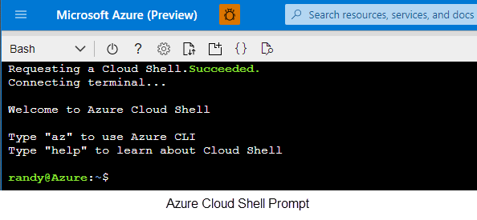
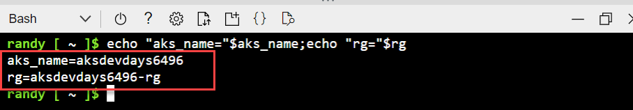
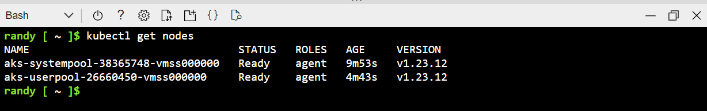

# Setup environment for the labs

Instructions to setup the environment and AKS cluster for the labs

>Duration 20 minutes

## Task 1: Setup Cloud Shell

In this exercise you log into your Azure Subscription and launch the Bash [Azure Cloud Shell](https://docs.microsoft.com/en-us/azure/cloud-shell/overview). The Azure Cloud Shell will give you a Linux shell prompt with all the required software installed and configured.

1. [Launch Cloud Shell](https://shell.azure.com/bash)

1. If this is your first time launching the Azure Cloud Shell, you will need to create a storage account.

    1. Choose Bash shell

    

    1. Create Cloud Storage

    

    
    > Use ***shift+insert*** to paste the commands from this document into the cloud shell terminal

3. At this point, you are logged in to Azure automatically via Cloud Shell, but you need to make sure Cloud Shell is pointed to the correct subscription if you have multiple Azure subscriptions. Set the current subscription. Your subscription name may be different.

```PowerShell
az account set --subscription "Azure Pass - Sponsorship"
```
## Task 2: Create Azure Container Registry
In this task you will create an azure container registry and later link the registry to your Kubernetes cluster to easily and securely pull images.

1. First, generate a unique name and create a resource group to organize the resources we will create in the Lab.  An Azure resource group is a logical container into which Azure resources are deployed and managed.

    ```bash
    aks_name="aksdevdays"$RANDOM
    rg=$aks_name"-rg"
    az group create -n $rg --location eastus
    ```

>NOTE: The registry name must be globally unique, 5-50 alphanumeric characters.

1. Generate a unique name for the Azure Container Registry name
    ```bash
    acr_name=$aks_name"acr"
    ```

1. Create the Azure Container Registry
    ```bash
    acr_server=$(az acr create \
        --resource-group $rg \
        --name $acr_name \
        --sku Basic \
        --query loginServer -o tsv)
    ```


## Task 3: Create AKS Cluster
In this task you will create the AKS Cluster linked to your Container Registry that you will use for the labs in this workshop


1. Closing the cloud shell will remove the **aks_name** and **rg** variables. Save the output of the following command to restore the variables needed in later labs.
    ```bash
    echo "aks_name="$aks_name;echo "rg="$rg;echo "acr_server="$acr_server;echo "acr_name="$acr_name
    ```



1. Create the AKS Cluster

    ```bash
    az aks create \
        --node-count 1 \
        --nodepool-name systempool \
        --generate-ssh-keys \
        --name $aks_name \
        --resource-group $rg \
        --attach-acr $acr_name
    ```

    >  NOTE:</br>
    This can take several minutes to complete


1. Add a User Node Pool. This will create a set of nodes dedicated to running user deployments

    ```bash
    az aks nodepool add \
    --resource-group $rg \
    --cluster-name $aks_name \
    --name userpool \
    --node-count 1 \
    --mode User
    ```

1. Configure the system node pool to host *only* system workloads.

    ```bash
    az aks nodepool update \
        -g $rg \
        --cluster-name $aks_name \
        -n systempool \
        --node-taints CriticalAddonsOnly=true:NoSchedule
    ```


1. Update cloud shell with your AKS credentials

    ```bash
    az aks get-credentials --resource-group $rg --name $aks_name
    ```

1. Verify connection to AKS
    ```bash
    kubectl get nodes
    ```
    

## Task 4: Clone the Git repository into your Cloud Shell environment

Within your Cloud Shell window, running the following command:
```bash
    git clone https://github.com/microsoft/aks-dev-day.git
    ls
```
You should see an **aks-dev-day** folder in your Cloud Shell window.
