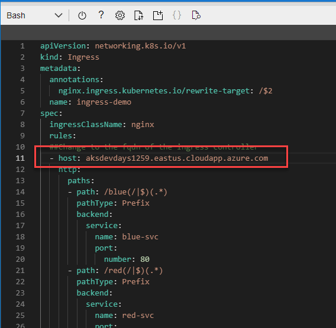
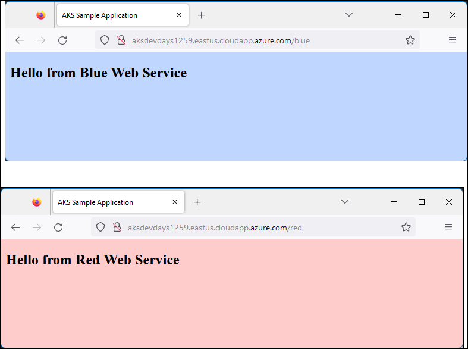

# Lab: Ingress 
In this lab you will install an Ingress Controller. a multi-tier application and Ingress rules to route Internet traffic to one of the the application services. There are many choices available for Kubernetes Ingress Controllers but in this lab you will install the NGINX controller Community Edition. 


>  NOTE</br>
There are two open source ingress controllers for Kubernetes based on Nginx: one is maintained by the Kubernetes community [kubernetes/ingress-nginx](https://github.com/kubernetes/ingress-nginx), and one is maintained by NGINX, Inc. [nginxinc/kubernetes-ingress](https://github.com/nginxinc/kubernetes-ingress). This Lab will be using the Kubernetes community ingress controller.

>Duration 30 minutes

### Setup 
If not already done, create an AKS Cluster according to the instructions found [here](../setup.md)

## Install NGINX Ingress controller 

### Create a Public IP Address with Fully Qualified Domain Name (FQDN)

Get the node resource group name for the AKS cluster created elarier
``` bash
ingress_dns=$aks_name
ip_rg=$(az aks show -n $aks_name -g $rg --query nodeResourceGroup -o tsv)
ip_name=$aks_name"-ip"
```

Create the  public IP Address
``` bash
az network public-ip create -g $ip_rg -n $ip_name --dns-name $ingress_dns --allocation-method Static --sku Standard --query dnsSettings.fqdn
```
Get the IP Adress to assign to the Ingress Controller
``` bash
ingress_ip=$(az network public-ip show -g $ip_rg -n $ip_name --query ipAddress -o tsv)
```


### Install an ingress controller using the new IP Address
``` bash
helm repo add ingress-nginx https://kubernetes.github.io/ingress-nginx
helm repo update
helm install ingress-nginx ingress-nginx/ingress-nginx \
  --create-namespace \
  --namespace ingress-basic \
  --set controller.service.annotations."service\.beta\.kubernetes\.io/azure-load-balancer-health-probe-request-path"=/healthz \
  --set controller.service.loadBalancerIP=$ingress_ip
```

### Deploy Applications 
Deploy 2 web servers one with a <span style=color:blue>Blue</span> background and one with a <span style=color:red>Red</span> background and 2 Internal [ClusterIP](https://kubernetes.io/docs/concepts/services-networking/service/#publishing-services-service-types) Services

``` bash
kubectl apply -f blue-deploy.yaml -f red-deploy.yaml
```


### Update ingress.yaml file to replace host with ingress domain name 
Get the Ingress Conroller Domain Name and copy to clipboard
``` bash
az network public-ip show -g $ip_rg -n $ip_name --query dnsSettings.fqdn -o tsv
```
> NOTE:</br>
Your Domain Name will be different
>


Edit ingress.yaml file and replace string **"[Replace]"** with your domain name from previous step 

```bash 
code ingress.yaml
```


Next: Save "ctrl+s" and quit editor "ctrl+q"

create ingress rules
``` bash
kubectl apply -f ingress.yaml
```

An incomming URL starting with <span style=color:blue>/blue</span> will be routed to the **blue-svc** service and a URL starting with <span style=color:red>/red</span> will be routed to the **red-svc**

```yaml
apiVersion: networking.k8s.io/v1
kind: Ingress
metadata:
  annotations:
    nginx.ingress.kubernetes.io/rewrite-target: /$2
  name: ingress-demo
spec:
  ingressClassName: nginx
  rules:
  ##Change to the fqdn of the ingress controller
  - host: [Replace]
    http:
      paths:
      - path: /blue(/|$)(.*)
        pathType: Prefix
        backend:
          service: 
            name: blue-svc
            port: 
              number: 80
      - path: /red(/|$)(.*)
        pathType: Prefix
        backend:
          service: 
            name: red-svc
            port: 
              number: 80
```


View the new ingress resource and wait for the **ADDRESS** to appear. It can take a few minutes for the address to appear. 
```bash
kubectl get ingress ingress-demo
```


Next, Open you local browser and navigate to the address under HOSTS and add **/blue** and **/red** to the URL

For example: 
1. ```http://askdevdays.eastus.cloudapp.azure.com/blue```
2. ```http://askdevdays.eastus.cloudapp.azure.com/red```



***CONGRATULATIONS!***  you have successfully installed an Ingress Controller and setup routing rules for your application running in Azure Kubernetes Service. 


## Cleanup
When finished, delete the application and Ingress resource from your AKS Cluster

```bash
kubectl delete -f blue-deploy.yaml -f red-deploy.yaml -f ingress.yaml
```