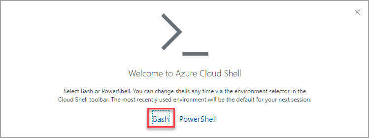
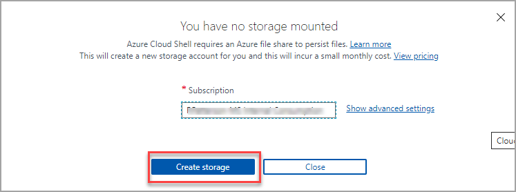

# Setup environment for the labs 
Instructions to setup the environment and AKS cluster for the labs 

>Duration 20 minutes

## Task 1
In this exercise you log into your Azure Subscription and launch the Bash [Azure Cloud Shell](https://docs.microsoft.com/en-us/azure/cloud-shell/overview). The Azure Cloud Shell will give you a Linux shell prompt with all the required software installed and configured.  

1. [Launch Cloud Shell](https://shell.azure.com)  (https://shell.azure.com)
1. When prompted, Log into your Azure Subscription 
1. If this is your first time launching the Azure Cloud Shell, you will need to create a storage account. 

    1. Choose Bash shell

     
    
    1. Create Cloud Storage

        

    
    > Use ***shift+insert*** to paste the commands from this document into the cloud shell terminal

## Task 2
In this task you will create the AKS Cluster that you will use for the labs in this workshop

1. First, generate a unique name and create a resource group to organize the resources we will create in the Lab.  An Azure resource group is a logical container into which Azure resources are deployed and managed.

    ```bash
    aks_name="aksdevdays"$RANDOM
    rg=$aks_name"-rg"
    az group create -n $rg --location eastus
    ```

1. Save this information for later 
    ```bash
    echo "aks_name="$aks_name;echo "rg="$rg
    ```

1. Create the AKS Cluster

    ```bash
    az aks create \
        --node-count 1 \
        --nodepool-name systempool \
        --generate-ssh-keys \
        --name $aks_name \
        --resource-group $rg
    ```

    <div style="border-radius: 25px; background: lightgreen; padding: 20px; margin: 15px 0 15px 0" > 

    <div><b>NOTE:</div>
    This can take several minutes to complete 
    </b></div>    

1. Add a User Node Pool. This will create a set of nodes dedicated to running user deployments 

    ```bash
    az aks nodepool add \
    --resource-group $rg \
    --cluster-name $aks_name \
    --name userpool \
    --node-count 1 \
    --mode User
    ```

1. Configure System Node to host *only* system workloads.

    ```bash
    az aks nodepool update \
        -g $rg \
        --cluster-name $aks_name \
        -n systempool \
        --node-taints CriticalAddonsOnly=true:NoSchedule
    ```


1. Update cloud shell with your AKS credentials 

    ```bash
    az aks get-credentials --resource-group $rg --name $aks_name
    ```

1. Verify connection to AKS
    ```bash
    kubectl get nodes
    ```
    

    